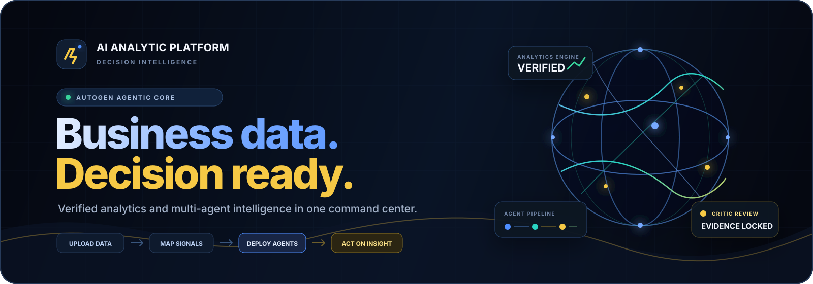

  

<h1 align="center">⚡ AI Analytic Platform</h1>

  <strong>AutoGen-powered sales and marketing intelligence for decision-makers.</strong>
   
  Upload business data. Watch specialist agents investigate it. Leave with a verified executive report.

  
  
  
  

  
  
  
  
  
  

  <a href="#-the-product">Product</a> •
  <a href="#-the-agentic-core">AutoGen agents</a> •
  <a href="#-architecture">Architecture</a> •
  <a href="#-run-it">Run locally</a> •
  <a href="#-deploy-to-render">Deploy</a> •
  <a href="#-api-surface">API</a>

  <code>UPLOAD</code> &nbsp;→&nbsp; <code>MAP</code> &nbsp;→&nbsp; <code>ANALYZE</code> &nbsp;→&nbsp; <code>DEPLOY AGENTS</code> &nbsp;→&nbsp; <code>ACT</code>

## ✦ Why AI Analytic Platform exists

Business reporting is usually fragmented across spreadsheets, dashboard tools, prompt windows, and manually formatted documents. AI Analytic Platform compresses that workflow into one secure command center.

Users upload sales or marketing data, map unfamiliar columns, explore live visualizations, and generate decision-ready reports. Metrics are computed from the selected source, while the agentic layer turns evidence into a clear narrative. If external AI is unavailable, a deterministic verified-data engine keeps the reporting workflow operational.

<table>
  <tr>
    <td align="center"><strong>7</strong> REPORT MODES</td>
    <td align="center"><strong>3</strong> SPECIALIST AGENTS</td>
    <td align="center"><strong>10K</strong> ROWS PER UPLOAD</td>
    <td align="center"><strong>6</strong> REPORT PLOT FAMILIES</td>
    <td align="center"><strong>1</strong> RENDER BLUEPRINT</td>
  </tr>
</table>

### The 30-second story

~~~mermaid
flowchart LR
    A["01 · Create account"] --> B["02 · Upload data"]
    B --> C["03 · Confirm mapping"]
    C --> D["04 · Explore live signals"]
    D --> E["05 · Deploy agents"]
    E --> F["06 · Export decisions"]
~~~

## ◈ The product

| Capability | What AI Analytic Platform delivers |
|---|---|
| **Agentic intelligence** | AutoGen Analyst, Report Writer, and Critic agents powered through GROQ |
| **Bring your own data** | Drag-and-drop CSV/JSON upload, validation, type inference, and editable smart mapping |
| **Visual evidence reports** | Six responsive plot families embedded in every applicable report and preserved in print |
| **Seven report modes** | Executive, sales, marketing, quarterly, product, regional, and custom intelligence |
| **Verified fallback** | Complete locally generated reports when AutoGen or GROQ is unavailable |
| **Private workspaces** | Account-isolated datasets, reports, favorites, and exports |
| **Production delivery** | FastAPI, React, PostgreSQL, Docker, Render Blueprint, health checks, and CI |
## 🧠 The agentic core

AI Analytic Platform includes a real integration with the current **AutoGen AgentChat API** using:

~~~python
from autogen_agentchat.agents import AssistantAgent
from autogen_ext.models.openai import OpenAIChatCompletionClient
~~~

### Proof in the repository

| Implementation | What it proves |
|---|---|
| `backend/agent_engine.py::_new_model_client()` | Connects AutoGen's OpenAI-compatible client to GROQ inside the deployed API |
| `backend/agent_engine.py::_run_pipeline()` | Creates and runs three real `AssistantAgent` instances with a revision loop |
| `backend/agent_engine.py::_analysis_prompt()` | Locks analysis to the exact KPI and chart snapshot selected by the user |
| `backend/report_engine.py` | Routes live FastAPI requests to AutoGen or the verified local fallback |
| `tests/test_agent_engine.py` | Verifies current client construction, agent order, grounding, criticism, and cleanup |

When `GROQ_API_KEY` is configured, the report engine executes this staged business-analysis workflow:

~~~mermaid
flowchart LR
    Q["Business question"] --> R["Verified data snapshot"]
    R --> A["AutoGen Analyst"]
    A --> W["AutoGen Report Writer"]
    W --> C{"AutoGen Critic"}
    C -->|Approved| O["Executive report"]
    C -->|Revision required| W
~~~

### The agents

| Stage | Responsibility |
|---|---|
| **Evidence lock** | Supplies only the selected user's calculated KPIs, filters, rankings, and chart series |
| **01 · Data Analyst Agent** | Calculates signals, trends, top performers, risks, and notable changes |
| **02 · Report Writer Agent** | Converts findings into a structured executive narrative with actionable recommendations |
| **03 · Critic Agent** | Checks grounding, numerical consistency, clarity, and unsupported claims |
| **Revision loop** | Sends rejected output back through analysis and writing before a final critic review |

The agent layer is deliberately separated from the analytics layer. AutoGen improves reasoning and narrative quality; it does not replace the calculated KPIs and charts.

### Production reliability strategy

~~~mermaid
flowchart TD
    S["Generate report"] --> A{"AutoGen installed + GROQ key?"}
    A -->|Yes| M["AutoGen multi-agent pipeline"]
    A -->|No external AI| L["Verified local data engine"]
    M --> X["Saved report"]
    L --> X
~~~

| Mode | Requirement | Result |
|---|---|---|
| **AutoGen multi-agent** | `GROQ_API_KEY` | Analyst → Writer → Independent Critic with one controlled revision loop |
| **Verified local engine** | No AI credentials | Deterministic Markdown report generated from calculated data |

> AutoGen AgentChat is pinned in the production dependency set and installed in the Render image. A provider outage never blocks core reporting: AI Analytic Platform records the failure server-side and immediately returns a complete evidence-grounded local report.

## ✦ Product experience

- Futuristic dark-glass interface with original cobalt-and-gold artwork, atmospheric workspace backgrounds, and optimized WebP delivery
- Responsive desktop, tablet, and mobile layouts
- Secure registration, login, logout, and persistent sessions
- Keyboard command palette with `Ctrl/⌘ + K`
- Active-source switcher across dashboard and AI Studio
- Loading, empty, validation, success, and failure states
- Searchable report library with favorites
- Markdown and structured JSON downloads, including the saved chart-data snapshot
- Print-ready reports that retain KPI cards, plots, tables, and evidence seals
- Optional email and Telegram report delivery

## ⬡ Architecture

~~~mermaid
flowchart TD
    U["Authenticated user"] --> UI["React command center"]
    UI --> API["FastAPI application"]
    API --> DB[("PostgreSQL / SQLite")]
    API --> DS["Dataset validation + mapping"]
    API --> AN["Deterministic analytics"]
    API --> RE["Report orchestrator"]
    RE --> AG["AutoGen + GROQ"]
    RE --> LF["Verified local fallback"]
    API --> EX["Exports + delivery"]
~~~

The production Docker image builds React with Node.js and copies the optimized assets into the Python runtime. FastAPI serves both the API and the single-page application from one Render service, keeping API requests and secure authentication cookies on the same origin.

### Engineering decisions that matter

| Decision | Why it matters |
|---|---|
| **Single-origin production** | React and FastAPI share one hostname, simplifying cookies, CORS, and deployment |
| **Deterministic metrics** | Charts and KPIs do not depend on probabilistic LLM output |
| **Fail-soft orchestration** | AutoGen → verified local engine prevents one provider failure from breaking reporting |
| **Account-scoped queries** | Every dataset and report lookup is filtered by the authenticated owner |
| **Multi-stage Docker build** | Node builds optimized assets; the final Python image only runs the application |
| **Route-level code splitting** | Heavy report and chart views load only when required |
| **Blueprint infrastructure** | Web service, PostgreSQL, secrets, and health checks are declared as code |

## ◫ Data Hub

Open **Data Hub** and drop in a UTF-8 `.csv` or `.json` file.

### Upload safeguards

- Maximum file size: **5 MB**
- Maximum rows: **10,000**
- Maximum columns: **80**
- Supported formats: **CSV and JSON**
- Automatic header normalization and duplicate-safe names
- Numeric/text type detection
- Account-level dataset isolation

JSON can be an array of objects or an object containing a `data`, `rows`, `records`, or `items` array.

The smart mapper recognizes aliases such as:

| Uploaded column | AI Analytic Platform field |
|---|---|
| `net_sales`, `sales_amount`, `gmv` | `revenue` |
| `quantity`, `qty`, `volume` | `units_sold` |
| `market`, `territory`, `location` | `region` |
| `spend`, `ad_spend`, `campaign_cost` | `budget` |
| `views`, `reach`, `exposures` | `impressions` |
| `orders`, `leads`, `signups` | `conversions` |

Every suggested mapping can be reviewed and corrected before the dataset becomes active.

### Sales template

`revenue` is required. Additional dimensions unlock richer filtering and charts.

~~~csv
product,region,quarter,revenue,units_sold,category
Analytics Pro,North,Q1 2026,125000,84,SaaS
~~~

### Marketing template

At least one of `budget`, `impressions`, `clicks`, or `conversions` is required.

~~~csv
campaign_name,channel,quarter,budget,impressions,clicks,conversions
Launch Campaign,Email,Q1 2026,5000,120000,6200,410
~~~

Both starter templates are downloadable inside Data Hub.

## ◇ Intelligence dashboard

AI Analytic Platform recalculates the complete dashboard whenever the user changes a dataset or filter:

- Total revenue and period-over-period movement
- Units sold
- Marketing budget and cost per conversion
- Impressions, clicks, conversions, CTR, and conversion rate
- Quarterly revenue velocity and revenue by region
- Top product drivers and channel-level CPA
- Full impression → click → conversion funnel
- Automatically detected business signals
- Recent generated reports

## ✧ Report Studio

| Mode | Best used for |
|---|---|
| **Executive brief** | Leadership-ready overview of revenue and marketing performance |
| **Sales performance** | Revenue, units, products, regions, and momentum |
| **Campaign intelligence** | Spend, conversion quality, channel efficiency, and CPA |
| **Quarterly pulse** | Period changes, growth signals, risks, and next-quarter priorities |
| **Product analysis** | Product contribution, concentration, and opportunity |
| **Regional analysis** | Market strength, regional mix, and expansion potential |
| **Ask the data** | A custom business question with optional analysis instructions |

Reports can be filtered, saved, searched, favorited, exported, deleted, and optionally delivered by email or Telegram.

### Every report is a visual evidence room

The report page does not merely decorate an AI narrative. It reconstructs plots from the immutable `chart_data` snapshot stored alongside that report, so the visuals, KPI strip, narrative, and JSON export all refer to the same filtered records.

| Plot | Decision it supports |
|---|---|
| **Revenue trajectory** | How did commercial output move across the available periods? |
| **Regional contribution** | Which markets lead, and where is performance concentrated? |
| **Product-mix donut** | Which offers dominate the current revenue portfolio? |
| **Acquisition momentum** | How did marketing spend and conversions move together? |
| **Channel efficiency** | Which channels combine conversion volume with attractive CPA? |
| **Acquisition funnel** | Where does reach fall away between impressions, clicks, and conversions? |

Plots are responsive on screen, included in browser print/PDF output, conditionally shown only when supporting data exists, and restored exactly when a saved report is reopened.

## 🚀 Run it

### Option A — Docker

~~~bash
docker build -t ai-analytic-platform .
docker run --rm -p 10000:10000 \
  -e JWT_SECRET="replace-with-a-long-random-secret" \
  ai-analytic-platform
~~~

Open <http://localhost:10000>, create an account, and start exploring. The bundled data and verified local report engine work without an AI key.

### Option B — Local development

Requirements: Python 3.12+, Node.js 20+, and npm.

#### Full web application

~~~bash
python -m venv .venv
source .venv/bin/activate
pip install -r requirements-dev.txt

cd frontend
npm ci
npm run dev
~~~

In a second terminal:

~~~bash
source .venv/bin/activate
uvicorn app:app --reload --port 8000
~~~

Open <http://localhost:5173>. Vite proxies `/api` requests to FastAPI on port `8000`. Interactive API documentation is available at <http://localhost:8000/api/docs>.

<strong>Windows PowerShell commands</strong>

~~~powershell
py -m venv .venv
.\.venv\Scripts\Activate.ps1
pip install -r requirements-dev.txt

cd frontend
npm ci
npm run dev
~~~

Start the API from a second PowerShell window:

~~~powershell
.\.venv\Scripts\Activate.ps1
uvicorn app:app --reload --port 8000
~~~

#### Activate Microsoft AutoGen

AutoGen AgentChat is already installed by `requirements.txt` and `requirements-dev.txt`. Add a GROQ key before starting FastAPI:

~~~env
GROQ_API_KEY=your_groq_api_key
GROQ_MODEL=llama-3.3-70b-versatile
~~~

With the key configured, `backend/agent_engine.py` runs the deployed Analyst → Writer → Critic pipeline. Without the key—or if the provider is temporarily unavailable—AI Analytic Platform automatically uses deterministic local reporting. Install `requirements-legacy.txt` only if you also want to run the original standalone Streamlit/ChromaDB scripts.

#### Test the production-style single origin

~~~bash
cd frontend && npm run build && cd ..
uvicorn app:app --host 0.0.0.0 --port 10000
~~~

## ☁ Deploy to Render

The repository contains a complete `render.yaml` Blueprint.

1. Push the extracted project to GitHub.
2. In Render, choose **New → Blueprint**.
3. Connect the repository.
4. Confirm the `ai-analytic-platform` web service and `ai-analytic-platform-db` PostgreSQL database.
5. Supply `GROQ_API_KEY` when the Blueprint prompts for the unsynced secret.
6. Deploy.

Render will build React and FastAPI, provision PostgreSQL, inject `DATABASE_URL`, generate `JWT_SECRET`, expose port `10000`, and monitor `/api/health`.

No separate frontend service, backend URL, or production CORS rewrite is needed.

### Enabling full AutoGen on Render

No Dockerfile edit is required. The production image already installs pinned AutoGen AgentChat packages, and `render.yaml` declares `GROQ_API_KEY` as a protected unsynced value so Render requests it during Blueprint creation. `/api/system/status` will report `autogen_enabled: true` and identify the active GROQ model after deployment.

## ⚙ Configuration

Copy `.env.example` for local development. Render provides the mandatory production values through `render.yaml`.

| Variable | Required | Purpose |
|---|---:|---|
| `DATABASE_URL` | Production | PostgreSQL URL; defaults to local SQLite |
| `JWT_SECRET` | Production | Signs session tokens; generated automatically by Render |
| `ENVIRONMENT` | No | Use `production` for secure cookies and HSTS |
| `SESSION_MINUTES` | No | Login duration; defaults to 10,080 minutes |
| `CORS_ORIGINS` | Development | Comma-separated development frontend origins |
| `GROQ_API_KEY` | AutoGen/AI | Activates the production AutoGen AgentChat pipeline |
| `GROQ_MODEL` | No | Defaults to `llama-3.3-70b-versatile` |
| `GROQ_API_URL` | No | GROQ OpenAI-compatible chat-completions endpoint |
| `GMAIL_USER` | Email | Sender account |
| `GMAIL_APP_PASSWORD` | Email | Application password for SMTP delivery |
| `TELEGRAM_BOT_TOKEN` | Telegram | Bot token for Telegram delivery |

## 🔐 Security and reliability

- Argon2 password hashing
- Signed and expiring HTTP-only session cookies
- Secure cookies and HSTS in production
- Per-user authorization for every dataset and report lookup
- Upload size, row, column, encoding, extension, and schema validation
- ORM-backed database access and normalized safe filenames
- Security response headers and gzip compression
- Database connection pre-ping and health checks
- Deterministic report fallback
- No AI credentials required for core analytics

For a serious production launch, use a paid persistent database plan, enable backups, rotate secrets, and add edge-level rate limiting.

## 🔌 API surface

| Area | Endpoints |
|---|---|
| System | `GET /api/health`, `GET /api/system/status` |
| Authentication | `POST /api/auth/register`, `POST /api/auth/login`, `POST /api/auth/logout`, `GET /api/auth/me` |
| Datasets | `POST /api/datasets/upload`, `GET /api/datasets`, `GET/PATCH/DELETE /api/datasets/{id}` |
| Analytics | `GET /api/meta/options`, `GET /api/dashboard` |
| Reports | `POST /api/reports/generate`, `GET /api/reports`, `GET/PATCH/DELETE /api/reports/{id}` |
| Output | `GET /api/reports/{id}/download`, `POST /api/reports/{id}/deliver` |

FastAPI OpenAPI documentation is available at `/api/docs`.

## ✅ Verification

~~~bash
pytest -q
cd frontend && npm run build
~~~

The test suite verifies unauthenticated protection, registration, sessions, bundled analytics, CSV upload, alias-based mapping, custom dataset KPIs, richer chart snapshots, report generation, current AutoGen client construction, three-agent execution order, critic review, JSON export, deletion, and logout.

## 🗂 Project map

~~~text
backend/
  main.py               FastAPI routes and SPA serving
  security.py           Authentication, hashing, and sessions
  datasets.py           Upload parsing, validation, and field mapping
  analytics.py          Verified KPI and chart calculations
  agent_engine.py       Production AutoGen Analyst/Writer/Critic pipeline
  report_engine.py      AutoGen/local report selection and fail-soft routing
frontend/
  src/                  React application
  public/images/        Original AI Analytic Platform visual assets
  dist/                 Optimized production build
data/                   Bundled sales and marketing records
tests/                  API and AutoGen orchestration tests
agent.py                Original standalone agent workflow (compatibility)
report_generator.py     Original standalone report workflow (compatibility)
requirements.txt        Production FastAPI + AutoGen dependencies
requirements-legacy.txt Optional Streamlit, ChromaDB, and delivery dependencies
Dockerfile              Multi-stage production image
render.yaml             Render Blueprint
app.py                  ASGI entry point
~~~

## ♡ Health check

~~~bash
curl http://localhost:10000/api/health
~~~

Expected response:

~~~json
{
  "status": "healthy",
  "service": "ai-analytic-platform-api",
  "version": "2.0.0"
}
~~~

---

### Built to turn business data into decisions—not just another dashboard.

**FastAPI · React · AutoGen · GROQ · PostgreSQL · Docker · Render**

